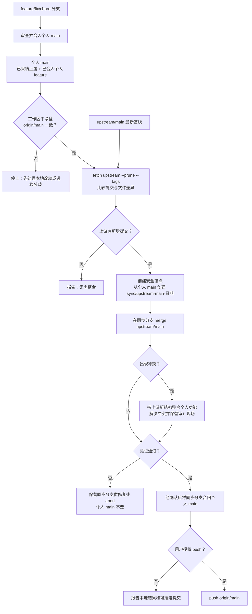

# Fork Repository Maintenance Skill PRD

日期：2026-07-29
状态：提案（仅定义产品需求，尚不创建 Skill）

## 1. 背景

开发者 Fork 外部仓库后，通常同时承担两种相互独立但容易混淆的职责：持续获取源仓库（`upstream`）的演进，以及在自己的 Fork（`origin`）中长期维护定制代码。若直接将上游分支覆盖到自己的 `main`，个人提交会丢失；若长期不接入上游，Fork 又会快速漂移，升级和安全修复成本随之累积。

本 Skill 暂定名为 `fork-repository-maintenance`，用于让 Codex 以安全、可审计、可回滚的方式维护一个 Fork 仓库的分支拓扑、上游同步和个人开发流程。

## 2. 产品目标

1. 保留个人 Fork 的 `main` 作为**个人集成主线**，绝不将其默认重置、强推或替换为上游内容。
2. 始终可追踪并同步源仓库的目标分支，默认是 `upstream/main`。
3. 规定所有个人功能、修复和实验分支均从个人 `main` 创建，并可安全回流个人 `main`。
4. 让上游同步成为一个显式、可审查的整合过程：先获取、比较与预演，再由用户确认写入。
5. 在每次可能覆盖历史或修改共享分支的操作前，提供可恢复锚点和清晰的风险提示。

## 3. 非目标

- 不替代 Git、GitHub/GitLab 的账号、权限、PR 或 CI 管理能力。
- 不默认创建远程仓库、推送、合并 PR、修改保护规则或执行强推。
- 不假设所有上游分支名都为 `main`；分支映射须可发现或由用户明确指定。
- 不自动解决代码冲突，更不在未审查的情况下选择冲突版本。
- 首版不充当多 Fork 镜像服务，也不管理二进制制品或发布渠道。

## 4. 核心概念与分支模型

### 4.1 远程角色

| 名称 | 角色 | 约束 |
| --- | --- | --- |
| `upstream` | 原始源仓库 | 只读参考源；只 fetch，不向其 push。 |
| `origin` | 用户自己的 Fork | 个人分支、个人 `main` 和协作 PR 的远程。 |

Skill 在首次运行时必须检查 URL、fetch/push URL 和默认分支，发现 `origin` 与 `upstream` 指向相同仓库、目标不可访问或 push URL 异常时停止并报告。

### 4.2 分支角色

```text
upstream/main ── fetch ──> 本地上游基线（只读）
      │
      │ 经同步分支显式整合：merge / rebase / cherry-pick（默认建议 merge）
      ▼
origin/main  <──> 个人 main（长期集成主线，保留已合入的个人 feature）
      │
      ├── feature/<topic>        个人功能分支
      ├── fix/<topic>            个人修复分支
      └── chore/<topic>          维护分支
```

- `upstream/main` 表示已 fetch 到本地的上游事实，不包含个人提交，不允许直接提交。
- `origin/main` / 本地 `main` 是个人拥有的主线，包含“已采纳的上游变更 + 已合入的个人 feature/修复”。它不是上游 `main` 的镜像。
- 个人开发分支必须以当时的本地 `main` 为基线；Skill 应记录基线提交，便于后续判断分支是否落后。
- 默认同步策略是从个人 `main` 创建同步分支，再将 `upstream/main` **合并**到该分支。验证通过后才将同步分支合回个人 `main`，从而保留两条历史和所有已合入的个人 feature。是否 rebase 由仓库策略和用户显式选择决定。

## 5. 目标用户与典型场景

| 场景 | 用户诉求 | Skill 应提供的结果 |
| --- | --- | --- |
| 首次接管 Fork | “帮我规范这个 Fork 的上游和分支。” | 非破坏性审计、远程/默认分支确认、分支策略建议和初始化计划。 |
| 例行同步 | “同步上游最新 main，但保留我的 main。” | fetch、差异摘要、预演、备份锚点、经确认后的整合与验证。 |
| 开始开发 | “基于自己的 main 开一个功能分支。” | 确认 main 干净且已推送，创建带命名规范的分支并记录基线。 |
| 上游发布修复 | “把上游某个修复带到我的版本。” | 定位提交/标签，评估是否已包含，生成 cherry-pick 或同步方案。 |
| 冲突处理 | “上游同步冲突了。” | 保存冲突状态、列出文件和两侧提交、给出逐步解决与安全退出路径。 |
| 健康检查 | “这个 Fork 还能安全同步吗？” | 报告远程、漂移量、未推送提交、工作区状态、分支基线和风险。 |

## 6. 功能需求

### 6.1 仓库发现与健康审计（MVP）

- 识别当前目录、Git worktree、当前分支、工作区状态和未跟踪文件。
- 枚举 `origin`、`upstream` 及其 fetch/push URL；必要时要求用户指定哪个是源仓库与个人 Fork。
- 发现上游默认分支和个人默认分支；支持 `main`、`master` 或显式映射。
- 计算个人 `main` 相对 `upstream/<branch>` 的 ahead/behind、共同祖先、未推送提交和本地未提交改动。
- 输出机器可读与人类可读的健康报告，并将任何不安全条件标为阻塞项。

### 6.2 上游同步与整合（MVP）

- 使用 `git fetch upstream --prune --tags` 更新上游引用，不直接改动本地工作分支。
- 显示上游新增提交、个人独有提交、变更文件摘要、潜在冲突风险和可选的目标策略。
- 默认生成“从个人 `main` 创建 `sync/upstream-<branch>-<date>`，并在其中合并 `upstream/<branch>`”的计划；在真正改动前要求明确确认。
- 写入前创建带时间与短 SHA 的本地安全锚点；同步分支也必须记录原 `main`、上游 SHA、策略和操作时间。
- 在同步分支完成后验证工作区状态、合并结果、测试命令（若仓库可发现）和与 `origin/main` 的差异；仅在用户确认后合回个人 `main`，并且仅在另一次用户授权后 push 到 `origin`。
- 支持仅 fetch、仅预演、整合、继续冲突处理、取消合并、从安全锚点恢复等阶段性操作。

### 6.3 个人主线与开发分支管理（MVP）

- 创建分支前验证本地 `main` 已同步 `origin/main`，且无未提交变更；异常时提供不丢数据的处理建议。
- 按 `feature/`、`fix/`、`chore/` 等可配置前缀从个人 `main` 创建分支，并记录创建基线。
- 审计开发分支与个人 `main` 的差距、是否已合并、是否存在未推送提交及其最近上游基线。
- 协助将完成分支通过 PR 或本地合并回个人 `main`；默认不删除本地或远程分支。
- 为“我的 `main` 必须是快进历史”的仓库提供显式 rebase 选项，但不作为默认行为。

### 6.4 选择性上游采纳（MVP）

- 按提交 SHA、PR 编号（在已配置平台工具时）或上游标签定位候选变更。
- 检查目标提交是否已在个人主线中，避免重复 cherry-pick。
- 为补丁采纳创建独立维护分支，执行前显示提交范围、依赖提交和冲突风险。
- 提供 `cherry-pick --no-commit` 的审查模式；用户确认后才提交或合并到个人主线。

### 6.5 审计、恢复与协作（MVP）

- 对每一次写操作记录操作 ID、时间、原始 SHA、目标 SHA、选用策略、远程 URL 和安全锚点。
- 支持查看最近操作、比较前后差异、恢复到指定锚点，以及导出同步报告供 PR 描述使用。
- 检查 `origin/main` 是否被他人更新；若远端已前进，停止并要求先拉取/协商，绝不默认 force-push。
- 识别 Git LFS、子模块、稀疏检出和 worktree；首版至少报告其存在及受影响范围，不能静默忽略。

### 6.6 后续增强（非 MVP）

- 多上游（例如社区维护分支、企业补丁分支）的优先级与整合策略。
- 按计划运行的只读漂移监控与提醒。
- 自动生成上游变更说明、升级风险清单、依赖/安全修复摘要和 PR 模板草稿。
- 基于提交路径或 CODEOWNERS 的冲突责任人提示。
- 可配置的策略文件，例如允许的整合方式、分支前缀、测试命令、保护分支和推送审批规则。
- GitHub/GitLab 平台集成：比较 PR、创建草稿 PR、读取检查状态；仍保持默认需要用户确认的写入边界。

## 7. 关键工作流

### 7.1 首次初始化

1. 只读审计仓库和 remotes，确认 `upstream` 与 `origin` 的真实角色。
2. 发现各自默认分支，默认映射为 `upstream/main` → `origin/main`，但不凭名称强行假设。
3. 读取保护规则、分支历史和现有个人改动，生成建议而不修改仓库。
4. 经用户确认后，仅补齐缺失的 `upstream` remote、上游 fetch 配置或本地跟踪配置；不改写已有 URL。
5. 保存仓库本地配置/审计记录，明确其是否应纳入版本控制。

### 7.2 常规同步（默认 merge 模式）

个人 `main` 在该流程开始时已经包含已完成并合入的个人 `feature/*`。因此，冲突发生在“上游最新变更”与“个人主线上的既有功能”之间；同步分支保护个人 `main`，但不会绕过或剔除这些功能。



1. 确认位于个人 `main`，工作区干净，且不存在未完成 rebase/merge/cherry-pick；确认本地 `main` 与 `origin/main` 一致。
2. fetch `upstream`，比较个人 `main`、`origin/main` 与 `upstream/main` 的拓扑。
3. 无上游新增提交时报告“无需整合”；个人主线落后 `origin/main` 时先停止处理该分歧。
4. 生成同步预览与安全锚点，等待用户批准；从当前个人 `main` 创建 `sync/upstream-main-<date>`。
5. 在同步分支将 `upstream/main` 合并进来；若冲突，在此分支解决，保留个人 `main` 不变并进入冲突处理流程。
6. 运行已发现或用户指定的验证；通过后才在用户确认下将同步分支合回个人 `main`，并报告可推送的提交，不自动 push。

### 7.3 冲突与恢复

1. 禁止继续执行新的同步或分支操作，先保存当前 Git 状态。
2. 报告冲突文件、双方相关提交、二进制/LFS/子模块特殊项和可使用的解决命令。
3. 用户解决后执行 `git add`、继续操作并运行验证；若用户选择放弃，则只执行对应 Git 操作的安全 abort。
4. 验证失败时保留同步分支供后续修复，或由用户选择 abort；个人 `main` 保持在同步前状态。
5. 任何已完成但结果不符合预期的整合，均通过已创建的安全锚点创建恢复分支或回退方案；绝不静默重写共享远端历史。

## 8. 安全、权限与决策规则

- **默认只读**：审计、fetch、差异分析和计划生成无需写工作树；fetch 是唯一默认允许改变本地 Git 引用的操作。
- **显式批准写入**：创建/切换分支、merge、rebase、cherry-pick、commit、tag、push、删除分支或修改 remote 前，必须逐项说明影响并等待确认。
- **禁止默认危险操作**：不执行 `push --force`、`reset --hard`、覆盖 remote URL、删除分支、清理未跟踪文件、自动 stash 或修改 `upstream`。
- **保护用户工作**：工作区脏、存在未完成 Git 操作、远程分支意外前进、目标分支不是预期跟踪分支时，停止而不是猜测。
- **可验证来源**：每份同步报告都应包含 upstream/origin URL、分支、提交 SHA、比较范围和安全锚点。
- **凭据边界**：Skill 不读取、打印、持久化或传递 Git 凭据、访问令牌和 SSH 私钥。

## 9. 建议的 Skill 形态（供实施阶段使用）

该 Skill 的复杂度和 Git 操作风险较高，应采用“简洁流程说明 + 确定性脚本 + 按需参考”的结构，而不是只依赖自然语言命令：

```text
skills/fork-repository-maintenance/
├── SKILL.md                     # 触发条件、操作阶段、确认边界
├── agents/openai.yaml            # Codex 展示信息
├── scripts/
│   ├── inspect_fork.py           # 只读拓扑、remote 与健康审计
│   ├── plan_upstream_sync.py     # 生成同步预演和风险报告
│   ├── create_safety_anchor.py   # 生成可追踪的恢复锚点
│   └── operation_log.py          # 记录和查询操作审计日志
├── references/
│   ├── branch-model.md           # 分支策略与策略选择
│   ├── conflict-recovery.md      # 冲突/中止/恢复步骤
│   └── special-git-features.md   # LFS、submodule、worktree、sparse checkout
└── tests/
    └── fixtures/                 # 本地裸仓库与 Fork 拓扑测试夹具
```

实现时须复用 Git 原生命令，不封装或隐藏其关键语义。脚本应支持 `--json`、`--dry-run` 和稳定的非零错误码；所有写入操作均须由 `SKILL.md` 的交互确认门禁包裹。

## 10. 成功指标与验收标准

### 10.1 成功指标

- 用户可在不丢失个人 `main` 提交的前提下，完成一次上游同步并得到完整审计报告。
- 例行同步前能明确看到上游新增、个人独有提交、潜在冲突和推送影响。
- 所有个人开发分支均可追溯到个人 `main` 的创建基线。
- 所有会改写历史或影响远端的风险操作在执行前均被阻止或要求明确确认。

### 10.2 最小验收场景

1. 上游新增提交、个人 `main` 已合入自有 feature：预演正确识别双方差异；同步分支 merge 后，个人功能仍可从历史和结果中找到。
2. 个人 `main` 与 `origin/main` 不一致：Skill 停止同步，不覆盖远端或本地任一方。
3. 工作区存在未提交改动：Skill 不切分支、不合并、不自动 stash，并解释恢复路径。
4. 上游整合产生文本冲突：Skill 能报告冲突、支持继续或 abort，不产生默认强推。
5. 用户创建 `feature/example`：其父提交等于当时个人 `main` 的 HEAD，并被记录到审计信息。
6. 用户选择一个已采纳的上游提交：Skill 检测重复并不再 cherry-pick。
7. 仓库包含 LFS、submodule 或附加 worktree：Skill 显式报告特殊状态和限制。

## 11. 待决策项

- 个人 `main` 的默认整合策略是否固定为 merge，还是允许按仓库配置选择 rebase？本 PRD 建议默认 merge。
- 审计记录放在仓库内（便于团队共享）还是用户本地配置目录（避免污染 Fork）？建议默认本地，提供显式导出。
- 是否将 `origin/main` 推送纳入 Skill 的 MVP？建议支持“生成并确认 push”，但默认不执行。
- 是否首版就集成 GitHub/GitLab API？建议先以本地 Git 为核心，平台能力作为后续增强。
- 分支命名、测试命令和保护规则应采用仓库局部配置、全局用户配置，还是两者分层合并？建议仓库局部优先、用户全局兜底。

## 12. 下一步

在用户确认本 PRD 后，再进入 Skill 设计与实现阶段：确定最终名称、配置文件格式、审计记录位置、默认整合策略与脚本接口；随后初始化 Skill、实现 MVP 脚本，并在临时裸仓库拓扑上做前向验证。
